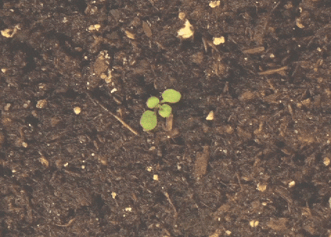
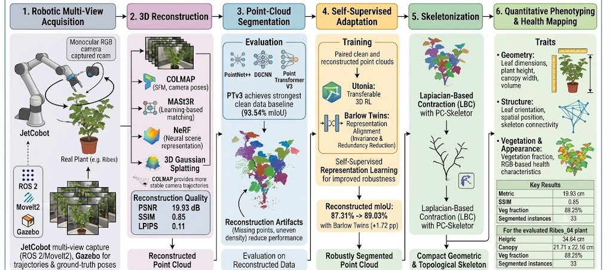
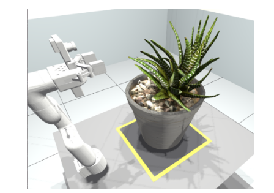
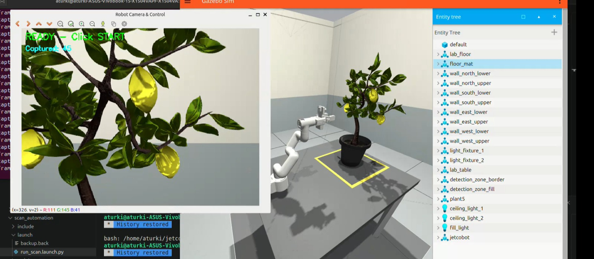
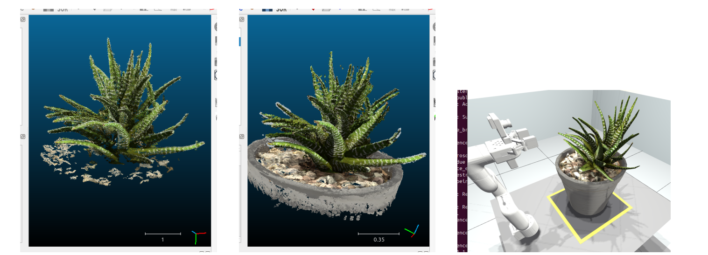
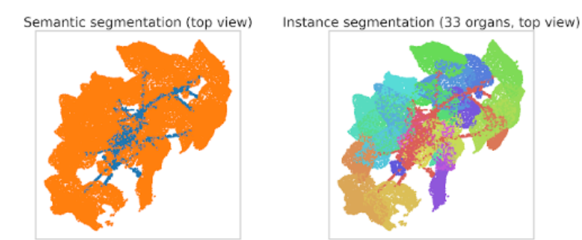
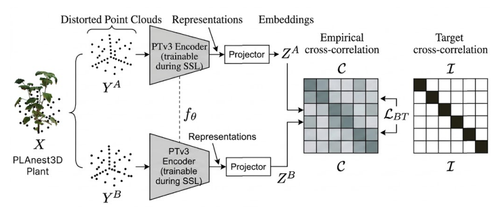
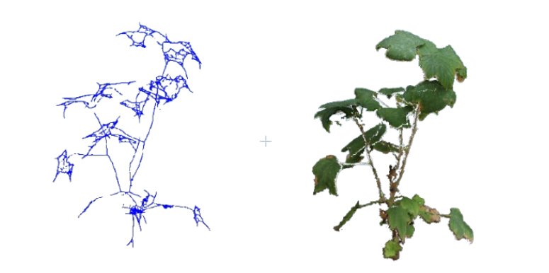
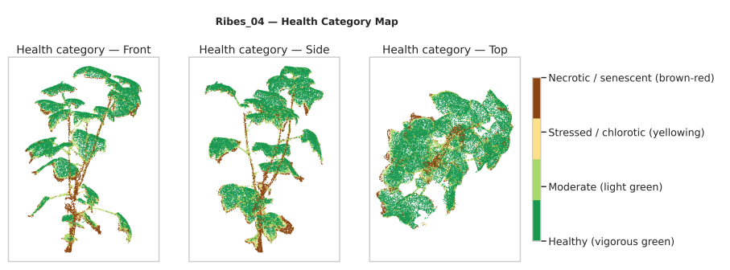

# 🌱 Robotic Plant Phenotyping

**Robust 3D plant phenotyping from monocular RGB images**

An end-to-end robotic pipeline for **automated plant acquisition, 3D reconstruction, point-cloud segmentation, skeletonization, and phenotypic analysis**.

The system combines a **7-axis JetCobot**, ROS 2, multi-view RGB imaging, modern 3D reconstruction, point-cloud deep learning, and self-supervised representation learning.

<p align="center">
  
</p>

<p align="center">
  <b>Robotic acquisition → 3D reconstruction → segmentation → skeletonization → phenotyping</b>
</p>

## 🔬 Pipeline

```text
Robotic Acquisition
        ↓
3D Reconstruction
        ↓
Point-Cloud Segmentation
        ↓
Self-Supervised Adaptation
        ↓
Skeletonization
        ↓
3D Plant Phenotyping
```

The workflow combines robotic multi-view acquisition with 3D reconstruction, point-cloud analysis, self-supervised learning, skeletonization, and phenotypic trait extraction.

<p align="center">
  
</p>

## 🤖 Robotic Acquisition

A **JetCobot 7-axis robotic arm** carries a wrist-mounted monocular RGB camera around the plant to capture multiple views.

ROS 2 and MoveIt2 control the scanning process, while Gazebo is used to validate trajectories and provide ground-truth camera poses.

<p align="center">
  
  
</p>

## 🧊 3D Reconstruction

RGB images are reconstructed using **COLMAP** and **MASt3R**, with **NeRF** and **3D Gaussian Splatting** evaluated as neural scene representations.

<p align="center">
  
</p>

| Method                 | Purpose                                             |
| ---------------------- | --------------------------------------------------- |
| **COLMAP**             | Structure-from-Motion and camera pose estimation    |
| **MASt3R**             | Learning-based image matching and 3D reconstruction |
| **NeRF**               | Neural scene representation                         |
| **3D Gaussian Splatting** | Neural scene representation                      |

COLMAP provides more stable camera trajectories in the evaluated setup, while MASt3R is more affected by pose drift under repetitive plant textures.

## 🧠 Point-Cloud Segmentation

Three 3D segmentation architectures are evaluated:

**PointNet++ · DGCNN · Point Transformer V3**

PTv3 achieves the strongest clean-data baseline with **93.54% mIoU**.

Reconstruction artifacts such as missing points, uneven density, and geometric variations reduce segmentation performance.

<p align="center">
  
</p>

## 🔄 Self-Supervised Adaptation

Paired **clean and reconstructed point clouds** are used for self-supervised representation learning to improve robustness to reconstruction artifacts.

<p align="center">
  
</p>

**Utonia**
Transferable 3D representation learning.

**Barlow Twins**
Representation alignment through invariance and redundancy reduction.

### Result

**87.31% → 89.03% mIoU**

**+1.72 percentage points** on reconstructed point clouds with Barlow Twins.

## 🦴 Skeletonization

Following segmentation, the plant geometry is converted into a structural skeleton using **Laplacian-Based Contraction (LBC)** with **PC-Skeletor**.

The resulting skeleton provides a compact representation for geometric and topological plant analysis.

<p align="center">
  
</p>

## 🌿 3D Phenotyping

The reconstructed and segmented plant is used to extract quantitative traits describing its geometry, structure, and appearance.

<p align="center">
  
</p>

**Geometry**
Leaf dimensions · plant height · canopy width · volume

**Structure**
Leaf orientation · spatial position · skeleton connectivity

**Vegetation & appearance**
Vegetation fraction · RGB-based plant health characteristics

For the evaluated **Ribes_04** plant:

| Trait                |                Value |
| -------------------- | -------------------: |
| Plant height         |         **34.64 cm** |
| Canopy width         | **21.71 × 22.16 cm** |
| Vegetation fraction  |           **88.25%** |
| Segmented instances  |               **33** |

## 📊 Key Results

| Metric                                   |       Result |
| ---------------------------------------- | -----------: |
| Best reconstruction PSNR                 | **19.93 dB** |
| Best reconstruction SSIM                 |     **0.85** |
| Best reconstruction LPIPS                |     **0.11** |
| PTv3 — clean mIoU                        |   **93.54%** |
| PTv3 — reconstructed mIoU                |   **87.31%** |
| PTv3 + Barlow Twins — reconstructed mIoU |   **89.03%** |
| Barlow Twins improvement                 | **+1.72 pp** |

## 📁 Repository

```text
Robotic-Plant-Phenotyping/
│
├── 3d_reconstruction/
├── segmentation/
├── SSL adaptation/
│   ├── utonia/
│   └── barlow twins/
├── skeletonization/
├── jetcobot_ws/
├── kinematics_pose/
├── docs/
└── references/
```

## 📄 Paper & Presentation

<p align="center">
  <a href="./docs/Towards_Robust_3D_Plant_Phenotyping__Robotic_RGB_Reconstruction__Point_Cloud_Segmentation__and_Self_Supervised_Adaptation_V5.0.pdf">
    
  </a>
  &nbsp;
  <a href="./docs/Jetcobot_Plant_phenotyping_Internship_Presentation.pdf">
    
  </a>
</p>

## 📚 References

The `references/` directory contains the main research papers and resources used throughout the project.

## 👤 Author

<p align="center">
  <b>Aymen Turki</b><br>
  INSAT · Intern at the <b>Intelligent Systems and Analytics (ISA) Group · NTNU</b>
</p>
