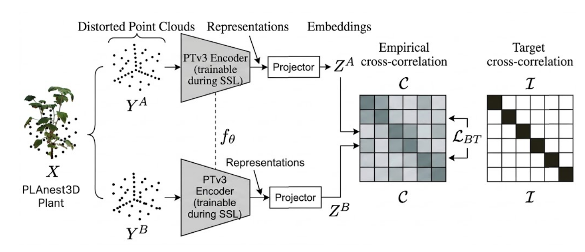
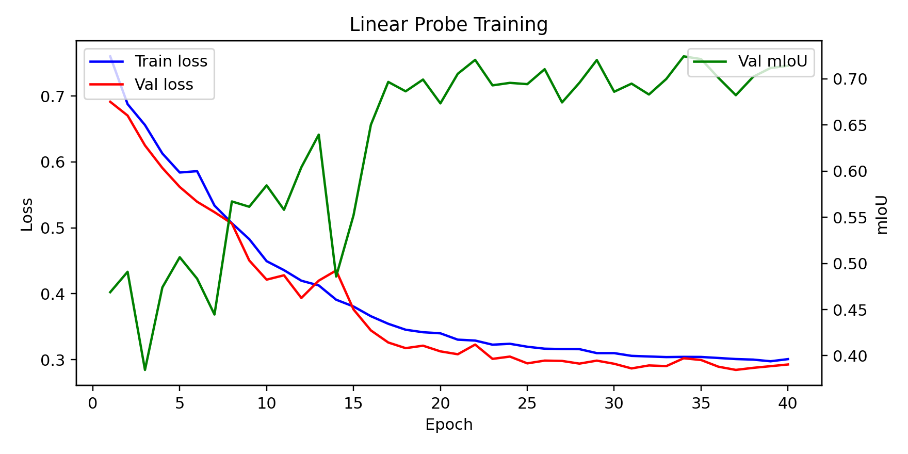

# Barlow Twins — Self-Supervised Learning

**Barlow Twins** is a self-supervised learning method that learns useful representations by comparing two differently transformed views of the same input. Instead of using negative samples, it minimizes the redundancy between representation dimensions while keeping corresponding features invariant.

In this project, Barlow Twins is investigated for **3D plant point clouds** to learn representations that are robust to variations in reconstruction, sampling, and point-cloud transformations.



## Method

Given two transformed views of the same point cloud,

```math
\mathcal{P}_1=\mathcal{T}_1(\mathcal{P}),
\qquad
\mathcal{P}_2=\mathcal{T}_2(\mathcal{P}),
```

the two views are processed by the same encoder:

```math
\mathbf{Z}^{(1)}=f_{\theta}(\mathcal{P}_1),
\qquad
\mathbf{Z}^{(2)}=f_{\theta}(\mathcal{P}_2)
```

The representations are normalized across the batch and their cross-correlation matrix is computed:

```math
\mathbf{C}_{ij}
=
\frac{
\sum_b Z^{(1)}_{b,i} Z^{(2)}_{b,j}
}{
\sqrt{\sum_b (Z^{(1)}_{b,i})^2}
\sqrt{\sum_b (Z^{(2)}_{b,j})^2}
}
```

The objective is to make this matrix close to the identity matrix:

```math
\mathbf{C}\rightarrow\mathbf{I}
```

The Barlow Twins loss is therefore defined as:

```math
\mathcal{L}_{BT}
=
\sum_i(1-C_{ii})^2
+
\lambda\sum_{i\neq j}C_{ij}^2
```

The first term encourages **invariance** between the two views, while the second term reduces **redundancy** between different representation dimensions.

The complete objective can be expressed as:

```math
\mathcal{L}_{BT}
=
\underbrace{\sum_i(1-C_{ii})^2}_{\text{invariance}}
+
\lambda
\underbrace{\sum_{i\neq j}C_{ij}^2}_{\text{redundancy reduction}}
```

This allows the network to learn representations without requiring manually labelled point clouds or negative pairs.

## Training

Training behavior is monitored using the generated training results:



The learned representations can subsequently be evaluated for downstream **plant and leaf segmentation, domain adaptation, and phenotyping** tasks.

## References

* **Barlow Twins: Self-Supervised Learning via Redundancy Reduction**
  [arXiv:2103.03230](https://arxiv.org/abs/2103.03230)
* [Barlow Twins — Video Explanation](https://www.youtube.com/watch?v=fNyyKJ22P8Y)
* [Barlow Twins — Video Explanation](https://www.youtube.com/watch?v=iudCl-n4hs0)
