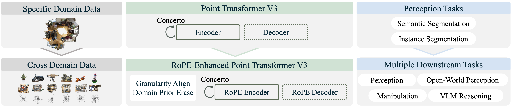
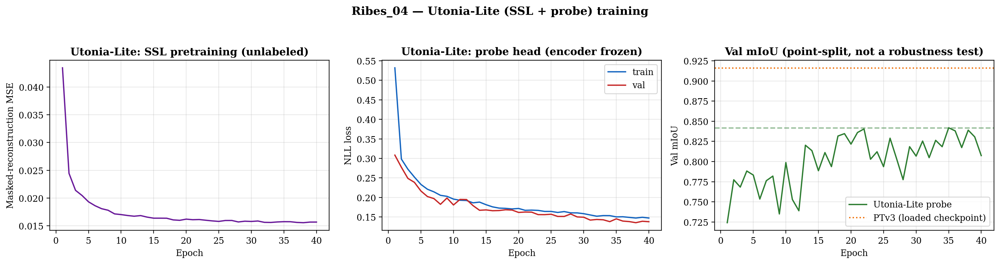

# Utonia — Self-Supervised Learning

Utonia is a **self-supervised 3D point-cloud foundation model** designed to learn transferable geometric representations across different point-cloud domains. In this project, it is adapted to **plant point clouds** to improve representation learning for downstream segmentation and phenotyping tasks.




## Method

Given a point cloud

```math
\mathcal{P}=\{(\mathbf{x}_i,\mathbf{f}_i)\}_{i=1}^{N}
```

where $\mathbf{x}_i\in\mathbb{R}^3$ represents the 3D position and $\mathbf{f}_i$ the point features, Utonia learns an encoder

```math
\mathbf{Z}=f_{\theta}(\mathcal{P})
```

that produces geometry-aware point representations.

The self-supervised objective encourages consistent representations between different views or transformations of the same point cloud:

```math
\mathcal{L}_{SSL}
=
\mathcal{L}
\left(
f_{\theta}\left(\mathcal{T}_{1}(\mathcal{P})\right),
f_{\theta}\left(\mathcal{T}_{2}(\mathcal{P})\right)
\right)
```

where

```math
\mathcal{T}_{1} \text{ and } \mathcal{T}_{2}
```

denote different point-cloud transformations or views.

Utonia introduces **Causal Modality Blinding**, **Perceptual Granularity Rescale**, and **RoPE-based spatial encoding** to improve cross-domain transfer.

## Training

Training behavior is monitored using the generated learning curves:



## References

* [Utonia Project Page](https://pointcept.github.io/Utonia/)
* [Official Implementation](https://github.com/Pointcept/Utonia)
* [Paper — arXiv:2603.03283](https://arxiv.org/html/2603.03283v1)
