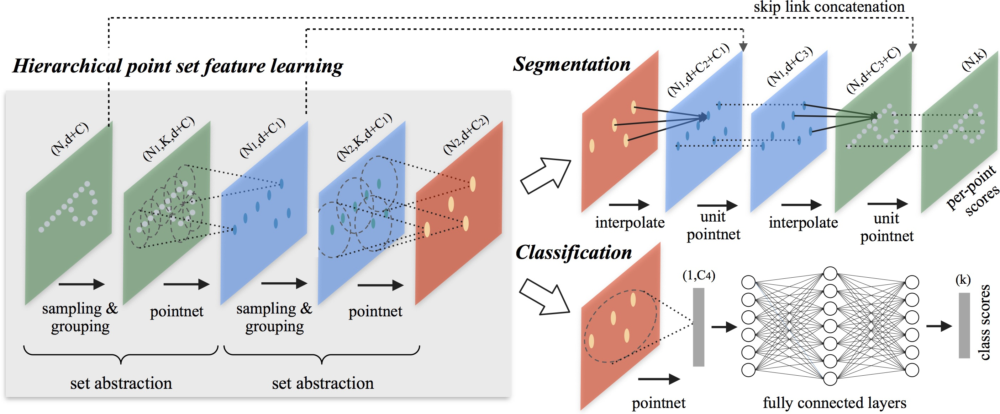
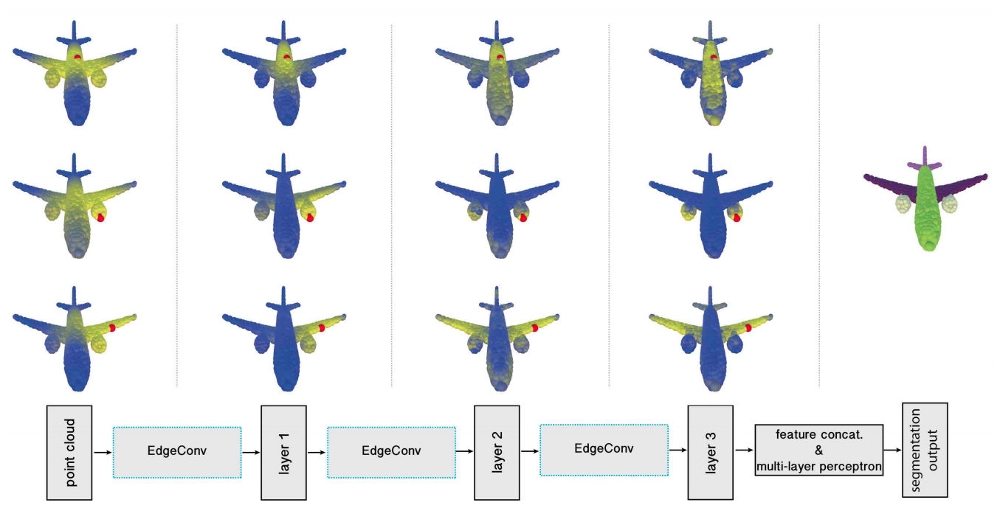
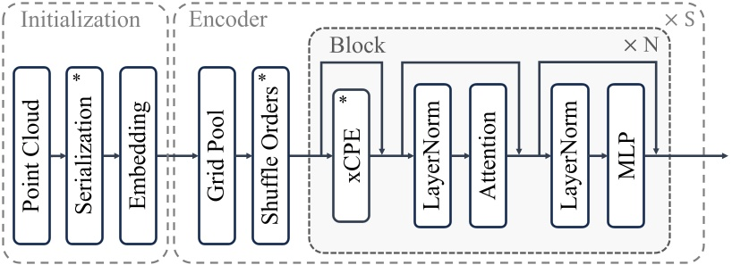
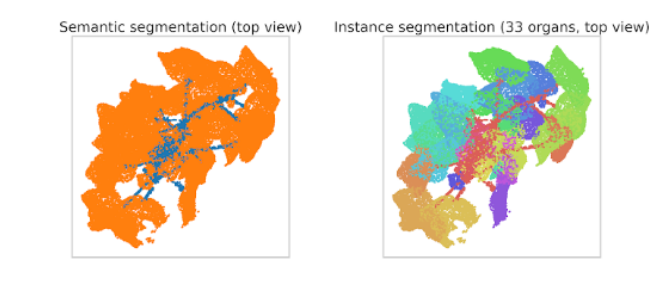

# 3D Plant Segmentation

This directory contains the 3D plant point-cloud segmentation experiments conducted on the **PLANesT3D** dataset.

Three segmentation methods are evaluated and compared for their ability to segment plant point clouds into organs (e.g. leaf, stem, soil/background).

---

## Methods

### PointNet++
Hierarchical point-based network that learns local geometric features at multiple scales by recursively applying set abstraction on nested point neighborhoods.

$$f_i = \mathrm{MLP}\left([x_i,\;\mathrm{AGG}_{j\in\mathcal{N}(i)} f_j]\right)$$

### DGCNN
Graph-based network that dynamically constructs a k-NN graph in feature space and models local geometric relationships between neighboring points using EdgeConv layers.

$$e_{ij} = h_\theta(x_i,\;x_j-x_i)$$
$$x'_i = \max_{j\in\mathcal{N}(i)} e_{ij}$$

### Point Transformer V3
Transformer-based architecture that uses self-attention to model relationships between points, enabling it to capture larger-scale geometric context than purely local aggregation methods.

$$\mathrm{Attention}(Q,K,V) = \mathrm{softmax}\left(\frac{QK^T}{\sqrt{d}}\right)V$$

---

## Results

The segmentation outputs of the three architectures are compared on the PLANesT3D plant point clouds.

| Method | Description | Key Property |
|---|---|---|
| PointNet++ | Hierarchical local feature learning | Multi-scale set abstraction |
| DGCNN | Dynamic graph EdgeConv | Local geometric relationships |
| Point Transformer V3 | Attention-based point transformer | Larger-scale geometric context |

---

## Robustness

A degradation pipeline is used to evaluate segmentation robustness under variations in:

- **Point density** — sparsifying or subsampling the input cloud
- **Missing points** — simulating occlusion or incomplete scans
- **Noise** — perturbing point coordinates with random noise

---

## Dataset

Experiments use the **PLANesT3D** dataset of 3D plant point clouds. Place the dataset under `data/` following the loader's expected structure before running the scripts.

## References

1. Qi, C. R., Yi, L., Su, H., & Guibas, L. J. *PointNet++: Deep Hierarchical Feature Learning on Point Sets in a Metric Space.* NeurIPS 2017. Project page: https://stanford.edu/~rqi/pointnet2/
2. Wang, Y., Sun, Y., Liu, Z., Sarma, S. E., Bronstein, M. M., & Solomon, J. M. *Dynamic Graph CNN for Learning on Point Clouds (DGCNN).* ACM TOG 2019. Code: https://github.com/WangYueFt/dgcnn
3. Wu, X., et al. *Point Transformer V3: Simpler, Faster, Stronger.* CVPR 2024. Code: https://github.com/Pointcept/PointTransformerV3
4. Point Transformer V3 overview/review: https://liner.com/review/point-transformer-v3-simpler-faster-stronger

