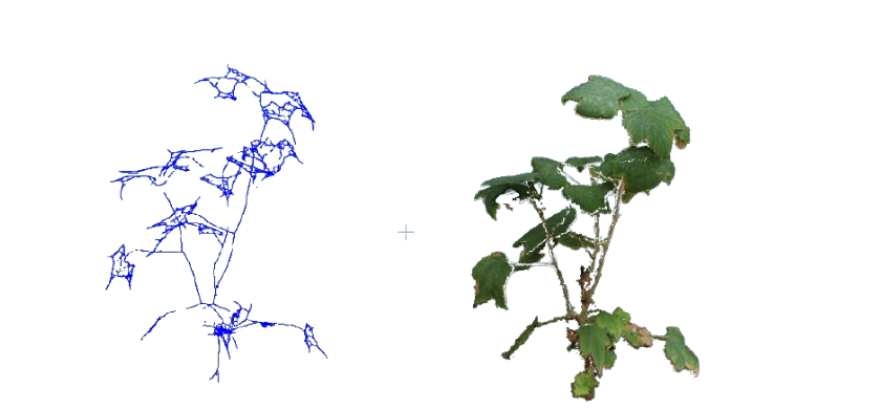

# Skeletonization

This module extracts 1D curve skeletons and topological graphs from 3D plant point clouds using **[PC-Skeletor](https://github.com/meyerls/pc-skeletor)**. It implements both **Laplacian-Based Contraction (LBC)** and **Semantic Laplacian-Based Contraction (S-LBC)** to convert point clouds into clean line graphs for measuring plant branching, internode lengths, and structural traits.

---

## 🧮 Mathematical Formulation

The core contraction process iteratively solves the linear system:
$$
\begin{bmatrix} \mathbf{W}_L \mathbf{L} \\\\ \mathbf{W}_H \end{bmatrix}
\mathbf{P}'
=
\begin{bmatrix} \mathbf{0} \\\\ \mathbf{W}_H \mathbf{P} \end{bmatrix}
$$

## Algebraic Description

* **$\mathbf{P} \in \mathbb{R}^{n \times 3}$**: Matrix representing the original point cloud of $n$ points.
* **$\mathbf{P}' \in \mathbb{R}^{n \times 3}$**: Matrix representing the contracted point cloud (target skeleton positions).
* **$\mathbf{L} \in \mathbb{R}^{n \times n}$**: Discrete Laplacian operator encoding local geometry.
* **$\mathbf{W}_L, \mathbf{W}_H$**: Diagonal weight matrices balancing **contraction forces** ($\mathbf{W}_L$, pulling points inward along local curvature) and **attraction forces** ($\mathbf{W}_H$, anchoring points near their original positions).
---

## 📑 Reference

This component is built upon the **[PC-Skeletor](https://github.com/meyerls/pc-skeletor)** library:

> **CherryPicker: Semantic Skeletonization and Topological Reconstruction of Cherry Trees**
> Lukas Meyer, Andreas Gilson, Oliver Scholz, Marc Stamminger (2023)

[[Paper](https://arxiv.org/abs/2304.04708)] | [[Repository](https://github.com/meyerls/pc-skeletor)]
